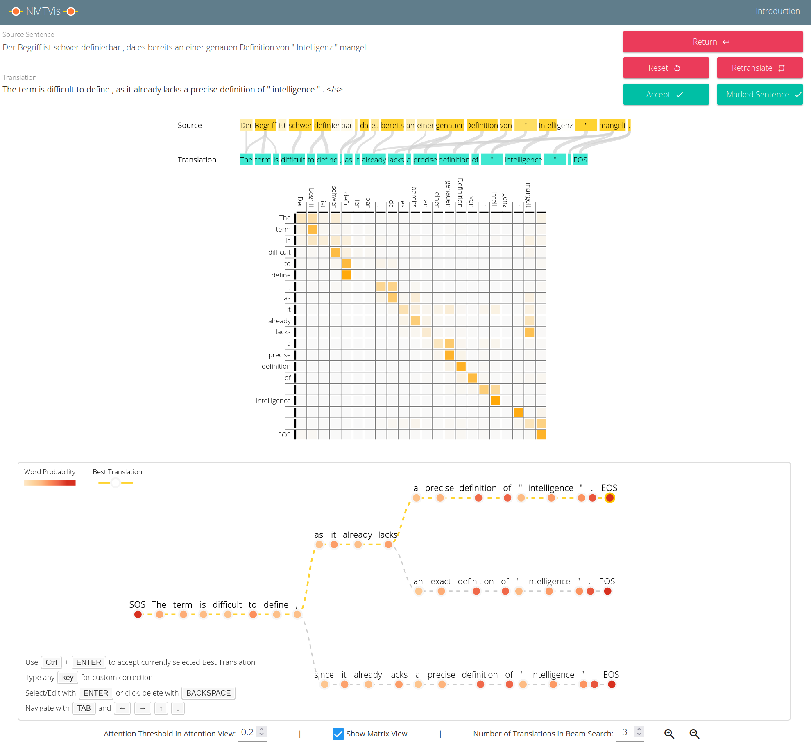

# Introduction

NMTVis is **visual analytics** system using an interactive machine-translation approach to support the translation of large documents.
The system takes an English (or German) document and translates it into German (or English), sentence by sentence.
Users can view the machine translations, and interactively correct them if necessary.
The system can improve its translations using these corrections.

## Main Functions

* Translate large, domain-specific documents (e.g., from computer science)
* Find incorrect translations through metrics and filtering
* Interactively correct translations
* Adapt the system and improve translations using users' corrections

## Main View

Document View: Metrics View (top left), Keyphrase View (top right) and list of sentences (bottom)

### Metric View (top left)

* This view c be used to filter and select sentences from the document based on metrics such as sentence length, confidence, ...
* Each metric is represented by an **axis** and each sentence is a **line** that intersects each axis at the value of that sentence for that metric.
* Sentences can be selected by hovering over a line or in the list of sentences below, and a highlighted sentence will appear as an orange line.   
* Green lines represent currently visible sentences in the Document View, while gray lines represent sentences that are currently filtered out.
* Brushing (clicking and draggin up/down) an axis with the mouse creates a filter for the respective metric. Remove the filter by clicking anywhere else on the axis.
* This filter can be dragged up and down, and multiple filters can be set.
* Sentences can be **sorted** based on metrics, by clicking on the sort icon below each axis.
* You can drag and drop axes to switch the order of metrics.

These are the metrics used in the Metrics View:

* **Document Order:** The index of a sentence in the document, e.g. the first sentence has index 0.
* **Confidence:** The confidence of the system regarding a translation. High values suggest a good
                translation, low values suggest errors.
            
* **Coverage Penalty:** This metric indicates if words from the source sentence were not translated. A
                high penalty may indicate translation errors.
            
* **Sentence Length:** The number of words in the **source sentence**. This is useful as long
                sentences may contain errors.
            
* **Keyphrases:** The number of keyphrases, i.e. domain-specific words, in a sentence. This metric is
                important to ensure such words are translated correctly.
            
* **Sentence Similarity:** This metric can be activated for a specific sentence by clicking the list
                icon on the right side of a sentence in the Document View.
                It indicates how similar a sentence is in relation to the reference sentence.
                You could add this metric for a sentence that was mistranslated and find similar sentences
                that might contain similar errors.
  
### Keyphrase View (top right)

* This view shows a list of keyphrases, which are domain-specific words, sorted based on their frequency.
* The number next to each keyphrase indicates its frequency and importance in the current document.
* By activating a keyphrase (clicking on the checkbox next to it), only sentences containing the keyphrase are displayed in the Document View.
* All active keyphrases are highlighted in the source sentence on the left, as well as their translation on the right.
* If a keyphrase was mistranslated by the system, this should be visible by looking at highlighted words.
* New keyphrases can be added by entering them in the text field below the list of keyphrases.

### Document View

* This view contains a list of all source sentences and their translations for the current filtering.
* Each sentence can be marked as correct or flagged for correction.
* Histograms on the fight side show an overview of the metrics previously introduced.
* User changes and changes by the model are highlighted.
* A sentence can be selected for further exploration and correction by clicking on it.

## Detailed View

Sentence View (top), Attention View (middle) and Beam Search View (bottom)

### Sentence View

* This view is text-based and allows manual modification of the translation.

### Beam Search View

* The Beam Search View shows you all translations generated by the system as a tree.
* The **number** of translations shown (beam size) can be changed at the bottom.
* Each **circle** represents a word, and **links** between words connect the words of a translation.
            
* The **color** of a circle represents the probability of system assigned to the related word.
* **Red circles** signify likely words, while **light circles** signify unlikely words.
* An **orange ring** around a circle highlights the currently selected word.
* Following the tree from the **SOS** (Start of Sentence) circle to an **EOS** (End of Sentence)
              circle, a complete translation is created.
            
* **Yellow links** represent the current best translation, which you can change by clicking on any
                other EOS circle.
  
#### Navigation and Interaction

Left: Navigation using arrow keys. Right: Custom correction ("experiments") or alternatives

* By moving from the **SOS** to a **EOS** circle, you complete a translation.
* Hover over a node to select a (partial) translation.
* You can move through the translations using <kbd>←</kbd> <kbd>→</kbd> <kbd>↑</kbd> <kbd>↓</kbd> keys as seen in the figure.
* Press <kbd>ENTER</kbd> or **click** to show alternative words to continue a translation.
* Type any <kbd>key</kbd> to create a custom correction, if you do not like any alternatives shown.
* Press <kbd>BACKSPACE</kbd> to remove the last character from your custom correction or move backwards.
* You can also use <kbd>TAB</kbd> to move forwards through a translation.

### Attention View

* The **Attention View** visualizes how words in the source sentence relate to words in the current translation and vice versa.
* Lines with varying thickness connect source words with translation words.
* The **thicker** the line, the more **important** the attached source word was for translating the word in the translation.
* If there is **no line** from a source word to any word in the translation, this might suggest that the word was not properly translated.
* During interaction with the Beam Search View, the Attention View highlights the relevant source words to aid in correcting a translation.
* You can also **hover** over words in the source sentence and translation, which highlights all related words in the respective other language.
