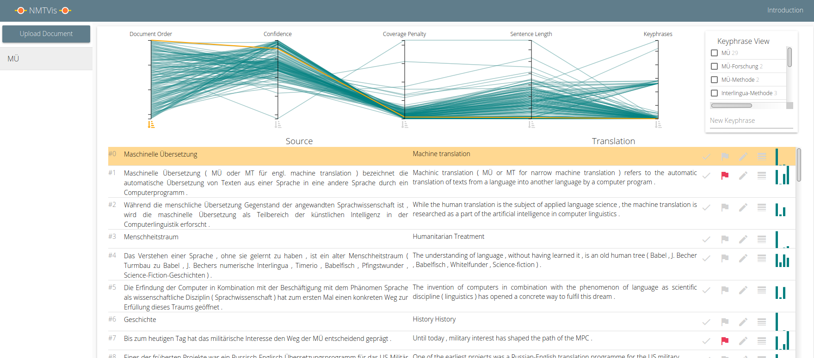

# NMTVis

[](https://doi.org/10.18419/darus-1849)



NMTVis is a system that supports users in correcting translations generated with neural machine translation.
Our system supports translation with an LSTM-based and the Transformer architecture.

It provides a web interface for visualizations and to support interactive correction.

You can find an introduction to our system [here](INTRO.md).

## Starting NMTVis

In order to run the system you need [Node.js](https://nodejs.org), [AngularJS](https://angularjs.org), [Python 3](https://www.python.org), and several Python modules defined in requirements.txt (see below for a more detailed description to prepare everything).

You start the server from the *nmtvis-server* directory with
```bash
python server.py -m [seq|trafo] -sl [de|en] -tl [de|en]
```

```bash
-m: model with options LSTM (seq) and Transformer (trafo)
-sl: source langugage with options German (de) and English (en)
-tl: target langugage with options German (de) and English (en)
```

You start the client from the *nmtvis-client* directory with
```bash
ng serve
```

Next, start the application in a browser:
[localhost:4200/documents](http://localhost:4200/documents).

Now, create a user (or use user = admin, password = admin for the default account) and upload documents for translation and correction.
Each document may contain multiple source sentences, each sentence has to be given in a separate line.
After uploading a new document you have to refresh the page.

## Preparing NMTVis

In the following, we describe in more detail how to set everything up to run the system.

### Translation Models

We prepared some trained models: [https://doi.org/10.18419/darus-1850](https://doi.org/10.18419/darus-1850).
They are for German to English translation and vice versa.
You have to place these models in the directories *nmtvis-server/.data/models/* under *transformer* for the Transformer models and *seq2seq* for the LSTM-based models.
Additionally, you have to place the vocabulary files in *nmtvis-server/.data/vocab/*.
Alternatively, you can train the models yourself, however, training will take several days.

### For the server:

First, install all python requirements (we used Python 3.8) for the server (in the *nmtvis-server/* directory ):
```bash
pip3 install -r requirements.txt
python -m spacy download en_core_web_sm
python -m spacy download de_core_news_sm
```

On Windows, you can install [pytorch](https://pytorch.org/get-started/locally/) like this:

Without CUDA:
```bash
pip install torch==1.4.0+cpu torchvision==0.5.0+cpu -f https://download.pytorch.org/whl/torch_stable.html
```
or with CUDA:
```bash
pip install torch===1.4.0 torchvision===0.5.0 -f https://download.pytorch.org/whl/torch_stable.html
```

### For the client:

First, you need Node.js:

On Linux (we used Xubuntu 20.04), you can get it like this:
```bash
sudo apt install curl
curl -sL https://deb.nodesource.com/setup_12.x | sudo -E bash -
sudo apt-get install -y nodejs
```
On Windows 10, download and install [Node.js](https://nodejs.org/en/download/).

On MacOS, we recommend using [homebrew](https://brew.sh/index_de):
```bash
brew install node
```

Next, install angular cli:
```bash
npm install -g @angular/cli
```

In case you have permission problems, you can follow [these](https://docs.npmjs.com/resolving-eacces-permissions-errors-when-installing-packages-globally) instructions.

Change to the directory nmtvis-client and install [AngularJS](https://angularjs.org):

```bash
npm install angular
```

## Preliminary Work

This project started as master thesis by Paul Kuznecov (his [NMT model](https://github.com/kuznecpl/nmtvis-model) and [server](https://github.com/kuznecpl/nmtvis-server) code)
and was later extended by an additional translation model and some additional features.

## License

Our project is licensed under the [MIT License](LICENSE.md).

## Citation

When referencing our work, please cite the paper *Visual-Interactive Neural Machine Translation*:

T. Munz, D. Väth, P. Kuznecov, N. T. Vu, and D. Weiskopf. Visual-Interactive Neural Machine Translation. Graphics Interface 2021. 2021. 

```
@inproceedings{nmt2021,
  author    = {Munz, Tanja and Väth, Dirk and Kuznecov, Paul and Vu, Ngoc Thang and Weiskopf, Daniel},
  title     = {Visual-Interactive Neural Machine Translation},
  booktitle = {Graphics Interface 2021},
  year      = {2021},
}
```
